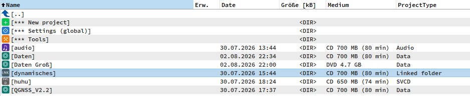
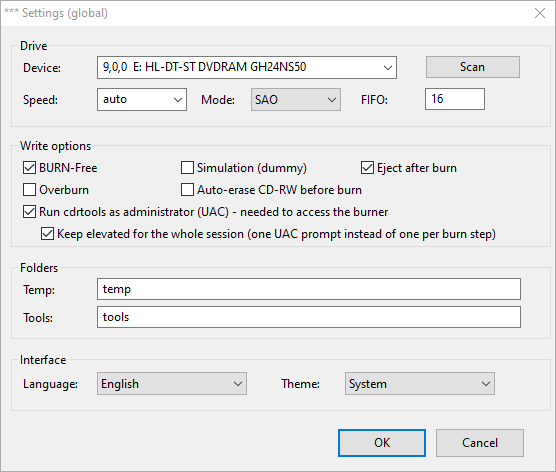
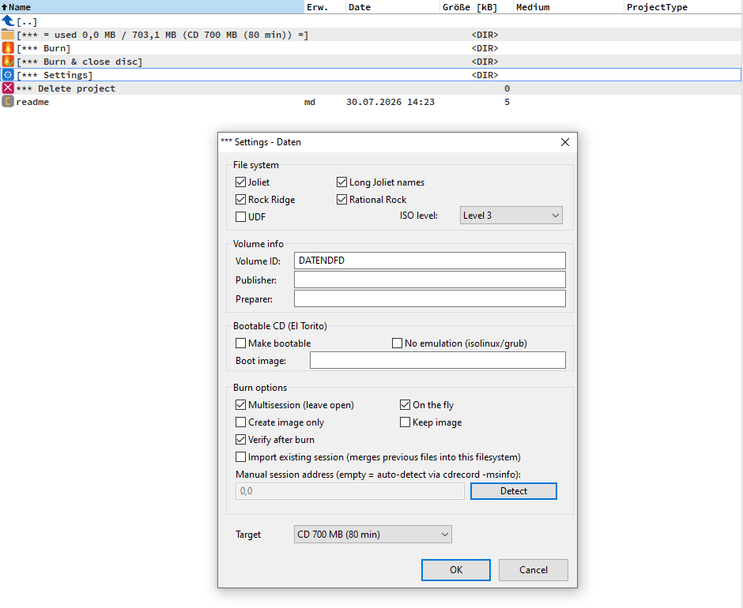

# wfx_cdr — CD/DVD burning plugin for Total Commander





A Total Commander file-system plugin (WFX) that lets you prepare files for
burning to CD/DVD as virtual **projects** and burn them with Jörg Schilling's
**cdrtools** — a Total Commander–native take on [cdrtfe](https://cdrtfe.sourceforge.io/cdrtfe/index_en.html).

Files are **referenced, not copied**: adding a file to a project only stores a
pointer to the original on disk. Nothing is duplicated; the burn reads the
originals. A validation pass before every burn makes sure every referenced file
and folder still exists.

## Namespace

```
\                             projects + *** Settings (global) + *** Tools\
\*** Tools\                   *** Erase CD/DVD (CD-RW), *** Disc info
\<project>\                   disc contents + fill meter + project commands
    *** Settings
    *** Burn
    *** Burn & close disc
    *** Delete project
```

Create a new project with **F7** at the root, or open `*** New project` there
(same result, for anyone who doesn't know the F7 shortcut) — asks for a name,
then a dialog asks the project type:
**Data** (files/folders, ISO9660+Joliet/Rock Ridge, El Torito boot), **Audio**
(CD-DA, per-track CD-Text, ReplayGain), **DVD-Video** (a `VIDEO_TS`/`AUDIO_TS`
tree, burned via `mkisofs -dvd-video`), **VideoCD** or **SVCD** (a flat list of
MPEG tracks, turned into a burnable image by `vcdimager`), or **Data (linked
folder)** — copy exactly one real folder into it and the project stores only
that folder's path, not a snapshot of its contents; every burn re-scans the
real folder fresh, so files added or removed on disk since the last burn are
picked up automatically. Only one folder per project, but individual loose
files can still be added directly at the project's root the normal way.
Copying an `.iso` file straight into the plugin root instead creates an
**ISO** project that burns that image directly. Add files/folders with **F5**,
rename/delete as usual. Projects are persistent across sessions (one UTF-8
`.ini` per project,
stored next to the plugin DLL, or under `%APPDATA%\wfx_cdr\` if the DLL folder
is read-only).

Languages: English, German, Russian, Ukrainian — editable in `lang\*.ini`,
switchable in the global settings.

## Required external tools (not bundled)

The plugin drives command-line tools; provide them yourself. It looks for each
`.exe` in this order (every tool resolved individually):

1. the folder set under **Settings (global) → Tools path**
2. `<plugin folder>\tools\`  (with `cdrtools\` and `sound\` sub-folders)
3. `<plugin folder>\cdrtfe\tools\`
4. the system `PATH`

### cdrtools (required)
`cdrecord.exe`, `mkisofs.exe`; optional `cdda2wav.exe`, `isoinfo.exe`,
`readcd.exe`. The cygwin builds additionally need **`cygwin1.dll`** in the same
folder.

- cdrtools: [sourceforge.net/projects/cdrtools/files](https://sourceforge.net/projects/cdrtools/files/)

### Audio decoders (required for MP3/Ogg/FLAC audio sources)
`mpg123.exe` (MP3), `oggdec.exe` (Ogg Vorbis), `flac.exe` (FLAC), and
optionally `wavegain.exe` (ReplayGain). WAV/RAW sources need no decoder.

### VideoCD / SVCD (required for VCD/SVCD projects)
`vcdimager.exe`, searched for in `tools\vcdimager\` (plus the usual override/
`cdrtfe\tools`/`PATH` locations). It is a Cygwin build and needs
**`cygwin1.dll` in the same folder** — without it the process starts and dies
immediately (Windows error `STATUS_DLL_NOT_FOUND`); the plugin detects this
case and shows a specific error instead of a generic failure. DVD-Video needs
no extra tool — it reuses `mkisofs.exe`/`cdrecord.exe` from cdrtools above.

### Easiest way to get everything at once
Install **cdrtfe**, which bundles all of the above under its `tools\` folder,
then either point the *Tools path* at `…\cdrtfe\tools`, or drop the plugin next
to a `cdrtfe\` folder (search location 3 above).

- cdrtfe (includes cdrtools + decoders + cygwin1.dll): [download](https://sourceforge.net/projects/cdrtfe/files/latest/download)

## Administrator rights (UAC)

If cdrtools needs elevation to reach the burner (**Settings (global) →
"Run cdrtools as administrator"**), each burn step normally triggers its own
UAC prompt. Turning on the second checkbox, **"Keep elevated for the whole
session"**, starts a small helper process (`wfx_cdr_broker.exe` /
`wfx_cdr_broker64.exe`, matching the plugin's own bitness) once per TC
session — one UAC prompt — and routes further elevated calls to it over a
local named pipe instead. The helper only ever runs the fixed set of
cdrtools/decoder executables from this plugin's own `tools\` folder (never an
arbitrary command), authenticates the plugin with a random per-session token,
and exits by itself as soon as the Total Commander process that started it
closes. It's optional — leave it off to keep the previous per-call behavior.

## Build

Lazarus / FPC 3.2.2, `{$mode Delphi}`. Build everything:

```
build.bat            REM -> wfx_cdr.wfx/.wfx64 + broker\wfx_cdr_broker.exe/64.exe
```

Total Commander loads `.wfx` in 32-bit and `.wfx64` in 64-bit processes. If
you use the "keep elevated" option above, copy both `wfx_cdr_broker.exe` and
`wfx_cdr_broker64.exe` from `broker\` next to `wfx_cdr.wfx`/`.wfx64` when
deploying — the plugin looks for them in its own folder, matching its
bitness.

## Install in Total Commander

Configuration → Options → Plugins → File system plugins (WFX) → Configure →
Add, and pick `wfx_cdr.wfx`. (Or let TC's plugin installer use `pluginst.inf`.)

## Status

Under active development. See `DESIGN.md` for the architecture and the
milestone plan. Namespace/persistence, settings dialogs, data/audio/ISO/
DVD-Video/VCD/SVCD burning and disc utilities are implemented; burning itself
needs a real drive and admin rights to verify and was not exercised on
real hardware as part of automated checks.
